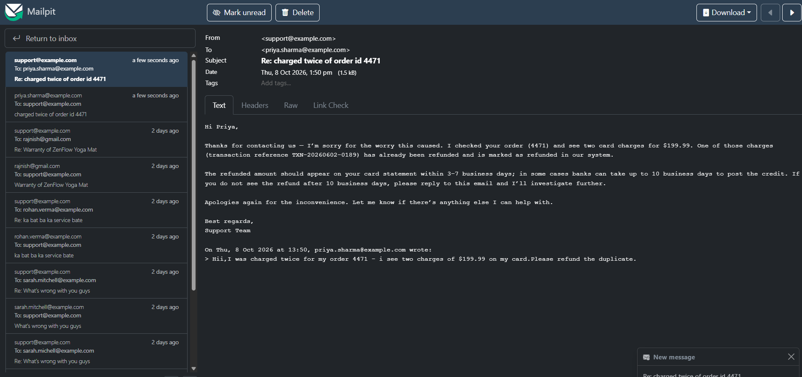

# Autonomous Customer Support AI Agent & MCP Server

[](https://jdk.java.net/21/)
[](https://spring.io/projects/spring-boot)
[](https://spring.io/projects/spring-ai)
[](https://www.mysql.com/)
[](https://www.docker.com/)
[](https://react.dev/)
[](https://modelcontextprotocol.io/)

An enterprise-grade, distributed AI Agent system built with **Spring Boot 4.x**, **Spring AI 2.x**, and **Java 21**. The platform autonomously ingests customer support emails, extracts intent using LLMs, retrieves domain knowledge via **Vector Database RAG**, and triggers secure backend operations (refunds, ticket creation, order tracking) using **Model Context Protocol (MCP)** tool calling.

---
## Demo

## Executive Summary

Traditional customer support systems struggle with response latencies and manual transaction handling. **CustomerSupportAgent** solves this by decoupling the AI Orchestration layer (`support-agent`) from the Core Business Domain tools (`mcp-server`) via Anthropic's **Model Context Protocol (MCP)**.

### Key Highlights:
- **Zero-Touch Email Automation:** Listens to incoming customer queries via `InboxMonitor`, routes them through Spring AI Agent, and automatically drafts/sends replies.
- **Model Context Protocol (MCP) Architecture:** Isolates enterprise data access (`SupportQueryTools`, `SupportActionTools`) behind a dedicated MCP server.
- **Hybrid RAG Retrieval:** Combines relational MySQL queries with Docker-based Vector database similarity search for accurate policy matching.
- **Autonomous Action Execution:** Processes order refunds, creates support tickets, and analyzes product feedback without human intervention.

---

## System Architecture & Workflow

```text
                                  ┌─────────────────────────────────────────┐
                                  │           React 19+ Dashboard           │
                                  └────────────────────┬────────────────────┘
                                                       │
                                                       ▼
┌──────────────────┐   IMAP/Mailpit   ┌─────────────────────────────────────────┐
│ Incoming Support │ ────────────────►│          support-agent Module           │
│     Emails       │                  │  (Spring AI 2.x + Inbox Monitor + RAG)  │
└──────────────────┘                  └────────────────────┬────────────────────┘
                                                           │
                                                           │ MCP (Model Context Protocol)
                                                           ▼
                                      ┌─────────────────────────────────────────┐
                                      │            mcp-server Module            │
                                      │    (Tool Provider + Spring Data JPA)    │
                                      └────────────┬────────────────┬───────────┘
                                                   │                │
                                      MySQL Database                Vector Search DB
                                  (Orders, Customers, Refunds)    (Knowledge Base Embeddings)
```
## 📁 Repository & Directory Structure

```text
CustomerSupportAgent/
├── mcp-server/                            # MCP Tool Provider Microservice
│   ├── src/main/java/com/rajnishsystems/in/mcpserver/
│   │   ├── domain/                        # JPA Entities
│   │   │   ├── Customer.java
│   │   │   ├── CustomerOrder.java
│   │   │   ├── OrderItem.java
│   │   │   ├── Payment.java
│   │   │   ├── Product.java
│   │   │   ├── Refund.java
│   │   │   ├── SupportTicket.java
│   │   │   └── Enums.java
│   │   ├── dto/                           # Data Transfer Objects
│   │   │   └── SupportDtos.java
│   │   ├── repository/                    # Spring Data JPA Repositories
│   │   │   ├── CustomerRepository.java
│   │   │   ├── OrderRepository.java
│   │   │   ├── PaymentRepository.java
│   │   │   ├── ProductRepository.java
│   │   │   ├── RefundRepository.java
│   │   │   └── SupportTicketRepository.java
│   │   └── tool/                          # Exposed MCP Tools for LLMs
│   │       ├── SupportActionTools.java    # Refund execution, ticket opening
│   │       └── SupportQueryTools.java     # Order & product database lookups
│   ├── compose.yml                        # MCP MySQL Container Config
│   └── pom.xml
│
├── support-agent/                         # Core Agent Orchestration Microservice
│   ├── src/main/java/com/rajnishsystems/in/supportagent/
│   │   ├── client/                        # Mail & API Integrations
│   │   │   └── MailpitClient.java
│   │   ├── config/                        # Agent & Email Properties
│   │   │   └── InboxProperties.java
│   │   ├── controller/                    # Test & Mail Seeding Endpoints
│   │   │   └── SeedMailController.java
│   │   ├── model/                         # Agent Request / Response Models
│   │   │   ├── AgentResponse.java
│   │   │   └── IncomingEmail.java
│   │   └── service/                       # AI Agent Core Logic
│   │       ├── AgentEmailHandler.java
│   │       ├── InboxMonitor.java
│   │       ├── SupportAgent.java           # Spring AI Orchestrator
│   │       └── SupportMailSender.java
│   ├── compose.yaml                       # Vector DB & Mailpit Setup
│   └── pom.xml
```
##  Tech Stack & Key Libraries

| Component | Technology | Version | Description |
| :--- | :--- | :--- | :--- |
| **Language** | Java | `21+` | Modern Virtual Threads & Pattern Matching |
| **Backend Framework**| Spring Boot | `4.x` | Reactive & Microservice Core |
| **AI Framework** | Spring AI | `2.x` | Orchestration, Embeddings, Function Calling |
| **Tool Protocol** | MCP | `1.x` | Model Context Protocol Specification |
| **Relational DB** | MySQL | `8.x` | Relational Storage for Customers & Orders |
| **Vector DB** | Docker-based Vector | `Latest` | Embedding Storage for Policy RAG Search |
| **Frontend UI** | React | `19+` | Admin Dashboard & Agent Analytics |
| **DevOps** | Docker / Compose | `v3.8+` | Microservice Containerization |

##  Core Functionality & MCP Tools

### 1. Autonomous Refund Processing
When a customer emails requesting a refund for an order:
* `InboxMonitor` triggers `SupportAgent`.
* The agent calls `SupportQueryTools.getOrderDetails(orderId)` to verify purchase legitimacy.
* If eligible, it invokes `SupportActionTools.processRefund(orderId, amount)` to execute the transactional refund in MySQL.
* `SupportMailSender` sends a personalized confirmation email containing the refund transaction ID.

### 2. Product Review & Feedback Routing
* Analyzes feedback sentiment from incoming emails.
* Persists critical product complaints into `SupportTicketRepository` tagged with priority.
* Automatically categorizes bug reports and escalates them to internal development teams.

### 3. RAG Knowledge Search
* Queries vectorized company policies (cancellation policies, warranty terms) using Spring AI Vector Store.
* Merges context with real-time transactional data to form accurate, hallucination-free answers.

---

##  Getting Started & Local Setup

### Prerequisites
* JDK 21 or higher
* Docker & Docker Desktop
* Maven 3.9+
* OpenAI / Gemini API Key

### 1. Clone & Configure
```bash
git clone [https://github.com/rajnish-chauhan/CustomerSupportAgent.git](https://github.com/rajnish-chauhan/CustomerSupportAgent.git)
cd CustomerSupportAgent
```

### 2. Start Infrastructure Services (MySQL, Vector DB, Mailpit)
```bash
# Start MySQL & Tool Server Infrastructure
cd mcp-server
docker compose up -d
```
# Start Vector DB & Mail Service Infrastructure
```text
cd ../support-agent
docker compose up -d
```

### 3. Run Microservices

**Start MCP Tool Server:**
```bash
cd mcp-server
./mvnw spring-boot:run
```

**Start Support Agent Engine:**
```bash
cd support-agent
export OPENAI_API_KEY="your-api-key"
./mvnw spring-boot:run
```

---

## Contact

* **Developer:** Rajnish Chauhan
* **LinkedIn:** [LinkedIn Profile](https://linkedin.com/in/rajnishchauhandeveloper)
* **Portfolio:** [Portfolio](https://rajnishsystems.in)
* **GitHub:** [GitHub Repositories](https://github.com/rajnish-chauhan)